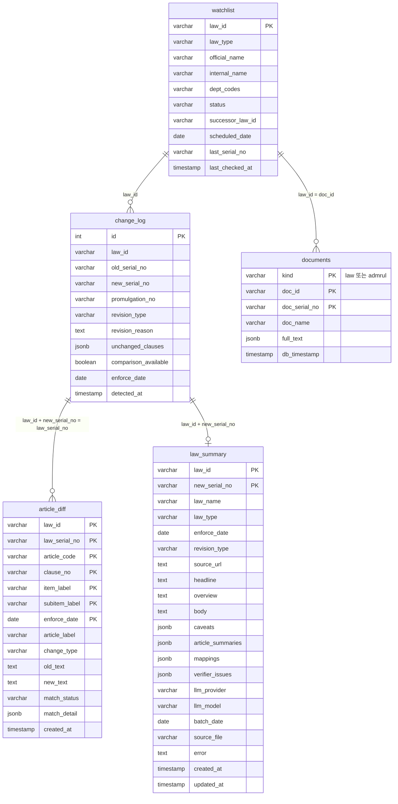

# 개발 문서 — 법령/행정규칙 개정 자동감지 파이프라인

> 설치·운영 안내는 [README.md](README.md)를 먼저 볼 것. 이 문서는 내부 구조와
> 설계 근거를 다루며, 유지·보수하거나 기능을 추가할 때 읽는다.


국가법령정보 Open API를 이용해 워치리스트에 등록된 법령/행정규칙의 개정 여부를
매주 감지하고, 조/항/호/목 단위로 구조화된 diff를 만든 뒤, LLM 멀티에이전트로
요약·검증해 웹페이지와 한글(HWPX) 보고서로 내보낸다.

## 아키텍처 개요

```
 ① 감지        watchlist(감시 대상 목록)의 일련번호를 API로 대조 → 바뀐 것만 추림
 ② 조문 비교    신구법 대비 파싱 → 6가드로 위치 확정 → article_diff 저장
 ③ 계약 JSON   out/weekly_contract_<날짜>.json  (여기까지가 src/lawtrack)
 ─────────────────────────────────────────────────────────────────
 ④ LLM 요약    매핑 → 조문별 요약(병렬) → 법령 종합    (summarizer/)
 ⑤ 검증        요약을 원문과 코드로 대조 (LLM 판단 없음)
 ⑥ 보고서      HWPX 생성 → 다시 열어 누락 대조
 ⑦ DB 적재     law_summary 테이블에 upsert
 ─────────────────────────────────────────────────────────────────
 ⑧ 웹페이지    law_summary를 읽어 브라우저에 렌더링 + HWPX 다운로드   (webapp/)
```

DB는 항상 하나의 진실의 원천이다 — 배치(`scripts/run_weekly.py`)가 채우고,
웹페이지(`webapp/`)는 그 결과를 읽기만 한다. 웹페이지 자체는 API를 호출하거나
LLM을 부르지 않는다(단, "기간별 즉석 조회" 기능은 예외 — 아래 [웹페이지](#웹페이지-webapp) 절 참고).

## 빠른 시작

전 단계를 한 번에 돌리려면:

```bash
python scripts/run_weekly.py --full
```

`--full` 없이 실행하면 ①~③(감지·비교)만 한다. ④부터는 호출 건당 LLM 비용이
들기 때문에 기본값을 꺼 두었다 — 감지 결과만 확인하려고 돌린 실행에서
조용히 과금되면 안 된다.

| 플래그 | 하는 일 |
|---|---|
| (없음) | 감지 → 조문 비교 → 계약 JSON. 비용 없음 |
| `--summarize` | + LLM 요약 JSON (`out/summaries/`) |
| `--hwpx` | + HWPX 보고서 (`out/reports/`). `--summarize` 포함 |
| `--summary-db` | + `law_summary` 테이블 적재. `--summarize` 포함 |
| `--full` | 위 전부 |

계약 JSON이 이미 있다면 요약 단계만 따로 돌릴 수도 있다:

```bash
python -m summarizer out/weekly_contract_2026-07-19.json --hwpx --db
python -m summarizer out/weekly_contract_2026-07-19.json --dry-run --echo  # API 키 없이 프롬프트만 확인
```

웹페이지를 켜려면(DB에 이미 `law_summary` 데이터가 있어야 함):

```bash
python -m webapp.app
```

## 요구사항

- Python 3.11+ (conda 환경 권장)
- PostgreSQL 14+
- 국가법령정보 Open API 인증키(OC) — <https://open.law.go.kr>에서 발급
- LLM API 키 (요약 단계를 쓸 경우)

```bash
pip install -e ".[openai]"          # 요약까지 (OpenRouter/원내 QWEN 도 OpenAI 호환이면 이것)
pip install -e ".[anthropic]"       # Anthropic 을 쓸 경우
pip install -e ".[openai,web,dev]"  # + 웹페이지(Flask, PDF 확인용 pypdfium2 포함) + pytest
```

**`pip install -r requirements.txt` 가 아니라 `pip install -e .` 를 쓴다.**
이 프로젝트는 패키지가 세 곳에 나뉘어 있어(`src/lawtrack`, `summarizer`,
`webapp`) 설치하지 않으면 `import lawtrack` 이 되지 않는다. 특히 작업
스케줄러는 대화형 셸의 `PYTHONPATH` 를 물려받지 않으므로, 설치해 두는 것이
자동 실행의 전제다.

## 환경변수 (`.env`)

프로젝트 루트에 `.env` 파일을 만든다(코드 저장소에 커밋하지 말 것 — 인증키/DB
비밀번호가 들어간다). `.env.example` 을 복사해 채우면 된다.

```env
# --- 1~2단계: 감지·비교 (src/lawtrack) ---
LAW_API_OC=발급받은_OC_인증키
POSTGRES_PASSWORD=PostgreSQL_비밀번호

# --- 3단계: 요약 (summarizer) ---
OPENAI_API_KEY=발급받은_API_키
SUMMARY_PROVIDER=openai
SUMMARY_MODEL=gpt-5.4-mini

# OpenRouter(여러 모델을 한 키로 호출하는 중계 서비스)를 쓰는 경우, 위
# 3줄 대신 이 3줄만 쓴다 — base_url(https://openrouter.ai/api/v1)은
# 코드가 자동으로 채우므로 SUMMARY_BASE_URL을 따로 적을 필요 없다.
# SUMMARY_PROVIDER=openrouter
# OPENROUTER_API_KEY=발급받은_API_키
# SUMMARY_MODEL=openai/gpt-4o-mini   # 형식: provider/model — openrouter.ai/models 참고

# 선택 (기본값 있음)
POSTGRES_HOST=127.0.0.1
POSTGRES_PORT=5432
POSTGRES_USER=postgres
POSTGRES_DATABASE=law_tracking_db
LOG_LEVEL=INFO
```

감지만 쓸 것이면 `LAW_API_OC` + `POSTGRES_PASSWORD` 만, 요약만 쓸 것이면
API 키만 있어도 된다 — 쓰지 않는 단계의 설정은 요구하지 않는다. 웹페이지는
DB 접속 정보만 있으면 된다(LLM 키 불필요 — 이미 요약된 결과만 읽으므로).

## 폴더 구조

```
src/lawtrack/
  config.py           .env 로딩 → Settings(api, db) — 다른 모든 모듈이 여길 통해 설정을 받음

  api/                국가법령정보 Open API HTTP 레이어 (요청/응답 파싱까지, 비즈니스 로직은 없음)
    client.py           공통 HTTP 클라이언트 (LawApiClient) — 인증키(OC) 부착, 재시도, LawApiError
    search.py           목록조회 API — 워치리스트 항목의 최신 일련번호·시행상태 확인
    fulltext.py          법령/행정규칙 "본문조회" API 호출 (전문 JSON 원본을 그대로 반환)
    oldnew.py            "신구법 비교" API 호출 (법제처가 만든 개정 전/후 대비 원본)

  parse/              api/ 가 받아온 원본 JSON을 구조화된 파이썬 객체로 변환 (여기까지는 파싱만, 위치확정 없음)
    fulltext.py          전문 JSON → 조/항/호/목 트리 (parse_articles: 법령 / parse_admrul_units: 행정규칙)
    oldnew.py            신구법 비교 API 응답 → (article_label, change_type, old_text, new_text) 레코드 목록
    jsonutil.py           위 둘이 공유하는 JSON 순회/정규화 유틸

  text/               순수 텍스트 로직 (외부 의존성 없음, 입출력이 전부 str/객체)
    normalize.py          공백·특수문자·순화표기 등 비교 전 정규화
    split.py              조문 원문을 항/호/목 단위 Fragment로 분리 (search_all/split_by_item/leading_marker)

  locate/             6단계 가드 파이프라인 — old_text가 신법 본문 어디에 해당하는지 확정 (이 프로젝트의 핵심 로직)
    locator.py            가드 1~6 순서대로 시도, 성공하면 위치 확정 / 전부 실패하면 unresolved로 보고

  db/                 PostgreSQL 접근 계층 — 테이블별 Repo 클래스로 분리 (아래 "데이터베이스" 절 참고)
    conn.py               커넥션 풀 + Database.cursor()/transaction() 컨텍스트매니저
    repo.py               WatchlistRepo / VersionRepo / ChangeLogRepo / ArticleDiffRepo / LawSummaryRepo

  link.py             연쇄개정 그룹핑 — 같은 공포번호로 같이 개정된 법들을 하나의 AmendmentGroup으로 묶음

  detect.py           워치리스트 1건 처리 파이프라인의 지휘자
                       (일련번호 변경 감지 → 본문/신구법 API 호출 → parse → locate → link → DB 저장)

  contract/           DB → LLM팀에게 넘길 최종 JSON 산출 계층
    schema.py             Pydantic 모델 전체 (WeeklyContract 이하 전 스키마, 아래 "산출물 구조" 절이 이 파일을 설명함)
    export.py             DB 테이블들을 읽어 위 Pydantic 모델로 조립 (build_contract) — structural_expansions 그룹핑도 여기

src/doc_match/        업로드 문서(PDF/HWPX) ↔ 워치리스트 매칭 — LLM 없이 순수 문자열 매칭 (웹의 "PDF 확인" 기능의 엔진)
  extract.py            PDF(pypdfium2)/HWPX(zip+XML) → 페이지별 텍스트
  normalize.py          법령명 표기 통일 (가운뎃점 6종·공백·인용부호·괄호접두 제거)
  dictionary.py         seed_watchlist.sql 파싱 → official/internal 이원 키 사전 + 수동 약칭("국가계약법" 등)
  match.py              매칭 엔진 — 긴 이름 우선(이중계상 방지), 원문 위치 보존(스니펫), 감시 대상 외 후보 수집
  report.py             법령별 인용 횟수·페이지 집계 → dict(웹)/텍스트(CLI) 리포트

summarizer/           계약 JSON → LLM 요약 → 검증 → HWPX 보고서 (3단계)
  config.py             .env 로딩 → Settings(llm, pipeline). lawtrack/config.py 와 같은 방식
  models.py              파이프라인 내부/출력 자료구조 (ArticleUnit, ArticleSummary, LawSummary 등)
  llm.py                LLMClient 프로토콜 + OpenAI/Anthropic 구현 + DryRunClient (프로바이더 교체 지점)
  loader.py             계약 JSON 로드 → 조문 단위(ArticleUnit)로 정규화, apply_mappings(). 전부 결정론적, LLM 미개입
  matching.py           구↔신 위치 대응의 계산 가능한 부분 (완전일치·밀림 가능성 판정)
  locfmt.py              위치 라벨(location_label) 조/위치 분리 + 항/호/목을 사람이 읽는 표기로 변환 (HWPX·규칙기반 문장이 공유)
  textdiff.py           어절 단위 텍스트 비교(공백 보존 토큰화) — triage/렌더러가 공유하는 토대
  triage.py             LLM 투입 전 결정론적 사전 선별 — 형식정비(기관명·인용법령명 일괄교체)는
                        LLM 없이 규칙으로 분류해 비용·리포트 노이즈를 줄임 (ArticleAgent.run() 안에서 호출)
  agents.py             MappingAgent / ArticleAgent / LawAgent (감수 에이전트는 없음 — 아래 verifier.py 참고)
  prompts/              에이전트별 프롬프트 — 가장 자주 고치는 부분이라 로직과 분리
  pipeline.py           오케스트레이션: 매핑 → 조문 팬아웃(병렬) → 법령 종합 → 검증
  verifier.py           요약을 원문과 코드로 대조 (환각·방향오류만). LLM 을 판단자로 쓰지 않는 이유는 파일 상단 주석 참고
  postprocess.py        LLM 출력 정리 (한자 오타 등)
  render.py             조문별 변경 목록을 코드로 조립 — 구조 사실은 LLM 에 맡기지 않는다
  report/               HWPX 보고서
    builder.py            ContractSummary → HWPX (표지/개요/목록/조문별 변경표/미확정/비교불가)
    layout.py             지면·표 배치 (폭, 열 너비, 칸 여백, 머리행)
    verify.py             생성한 HWPX 를 다시 열어 요약 텍스트가 온전히 들어갔는지 대조(내용 완전성)
    inspect.py            생성한 HWPX 를 다시 열어 표 너비·셀 정렬·빈 문단 비율 등 서식이 안 깨졌는지 검사(구조/레이아웃)
  sinks.py              저장처 — JsonSink / HwpxSink / DbSink (모두 같은 Sink 프로토콜)
  __main__.py           `python -m summarizer` 진입점

webapp/               Flask 앱 (아래 "웹페이지" 절 참고)
  app.py                 라우트(/, /summary, /download, /period-check, /period-status) + 렌더링 헬퍼(항/호/목 표기, diff 강조 등)
  laws.py                전문 보기(/laws, /laws/<law_id>) — 개정 전/후 전문 나란히 비교
  pdfcheck.py            PDF 확인(/pdf) — 업로드 문서에서 감시 대상 인용 찾기(src/doc_match 사용) + 최근 개정 배지·요약 한 줄
  live.py                "최근 5일/2주/1개월" 기간별 즉석 재조회 — 캐시·백그라운드 스윕·진행상태 트래킹
  templates/home.html     허브(세 기능 중 선택)
  templates/report.html   법령별 요약 페이지(검색, 구분별 섹션, 원문 보기 패널, 스크롤 스파이 내비게이션)
  templates/laws_list.html · law_detail.html   전문 보기 목록/상세
  templates/pdf_upload.html · pdf_result.html  PDF 확인 업로드/결과
  static/style.css        페이지 스타일
  static/img/logo.png     로고

scripts/
  setup_db.py         DB 최초 구축 — DB 생성 → 스키마 적용 → 워치리스트 적재를 한 번에. --check 로 현재 상태만 확인
  make_release.py     배포용 zip 생성 — 넘길 것만 골라 담는다(.env·보고서·out/ 제외). --dry-run 으로 목록만 확인
  run_weekly.py       주간 배치 진입점 — 감지·비교(기본) + 요약·보고서·DB적재(--full)
  weekly.cmd          작업 스케줄러가 실행하는 래퍼 (UTF-8 설정, 로그 적재, 종료코드 전달). ASCII 전용
  register_task.ps1   작업 스케줄러 등록/해제 + 사전 환경 점검(-Verify)
  run_single_check.py 법령/행정규칙 1건만 디버깅용으로 상세 실행 (locate 가드별 로그까지 출력)
  check_document.py   PDF/HWPX 1개를 CLI로 매칭 확인 (웹의 /pdf와 같은 엔진, 결과를 텍스트로 출력)
  load_watchlist.py   워치리스트 데이터 + 적재 로직 (setup_db.py 가 불러 쓴다. 단독 실행도 가능)

database/
  schema.sql          전체 테이블 정의 (DDL) — 아래 "데이터베이스" 절 참고
  seed_watchlist.sql  워치리스트 초기 데이터 (load_watchlist.py와 내용 동일한 데이터를 SQL로 표현)

tests/        pytest, 실측 데이터(실제 API 응답을 고정시킨 fixture) 기반 회귀 테스트. 파일명이 대상 모듈과 1:1 대응
              (예: test_split_jsonutil.py ↔ text/split.py + parse/jsonutil.py, test_export.py ↔ contract/export.py)
```

## 데이터베이스

PostgreSQL 14+, `database/schema.sql` 기준. 테이블 5개. **명시적 FK 제약은 없다**
— 관계는 애플리케이션 코드가 같은 값(law_id 등)으로 조인하는 논리적 관계다.
이 프로젝트에서 "진실의 원천"은 항상 `documents`의 전문 JSON이고, 나머지
테이블은 전부 거기서 파생되거나 그 처리 과정을 기록한 것이다.

### ERD



### `documents` — 법령/행정규칙 전문 아카이브

| 컬럼 | 타입 | 의미 |
|---|---|---|
| `kind` | VARCHAR(10) | `law` \| `admrul` — 법령/행정규칙 구분(PK 일부) |
| `doc_id` | VARCHAR(50) | 법령 ID 또는 행정규칙 ID(불변 식별자, PK 일부) |
| `doc_serial_no` | VARCHAR(50) | 일련번호(개정마다 바뀜, PK 일부) |
| `doc_name` | VARCHAR(255) | 법령명/행정규칙명 |
| `full_text` | JSONB | **법제처 API 원본 그대로** — 가공 없이 저장(진실의 원천, 재파싱 가능하도록 보존) |
| `db_timestamp` | TIMESTAMP | 삽입/수정 시각 |

- **PK**: `(kind, doc_id, doc_serial_no)` — 같은 법이라도 일련번호(버전)마다 별도 행.
- 개정이 감지되면 새 일련번호로 새 행이 **추가**되며, 기존 행은 지우지
  않는다 — 즉 매 버전이 그대로 쌓이는 이력 테이블이다.
- **행 존재 여부 자체가 개정감지 신호다**: `VersionRepo.law_exists(law_id,
  new_serial_no)`가 False면 "아직 안 본 버전"이라는 뜻이고, 이게 곧
  "개정됨"으로 판정되는 기준이다. 그래서 최초 구축 시 이 테이블을 절대
  미리 채우면 안 된다(아래 "DB 최초 구축 순서" 절 참고).
- 법령/행정규칙은 원래 별도 테이블(`laws`/`administrative_rules`)이었는데,
  컬럼 구성이 이름만 다를 뿐 완전히 같아 하나로 합쳤다. 조/항/호/목으로
  미리 파싱해 캐시하던 컬럼(`*_articles_parsed`)은 어느 코드도 다시
  읽지 않는 write-only 컬럼이라 제거했다 — 필요하면
  `parse_articles(full_text)`로 언제든 그 자리에서 다시 만들 수 있다.

### `watchlist` — 감시 대상 목록

| 컬럼 | 타입 | 의미 |
|---|---|---|
| `law_id` | VARCHAR(50) | **PK.** 법령/행정규칙 ID |
| `law_type` | VARCHAR(50) | 법률/시행령/시행규칙/행정규칙 |
| `official_name` | VARCHAR(255) | 현재 정식 명칭 |
| `internal_name` | VARCHAR(255) | 등록 당시 이름(제명변경 추적용, 산출물의 `internal_name`과 동일 개념) |
| `dept_codes` | VARCHAR(255) | 소관부처 코드(콤마 구분, 행정규칙 동명이인 구분용) |
| `status` | VARCHAR(50) | 현행/시행전 등 |
| `successor_law_id` | VARCHAR(50) | 폐지·통합된 경우 후속 법령 ID |
| `scheduled_date` | DATE | 시행예정일(아직 시행 안 된 경우) |
| `last_serial_no` | VARCHAR(50) | 마지막으로 확인한 일련번호 |
| `last_checked_at` | TIMESTAMP | 마지막 확인 일시 |

한 번 등록되면 삭제되지 않는 **단순 목록 테이블**이다(버전 이력이 아니라
"지금 감시 중인 항목이 무엇인가"만 담음). `run_weekly.py`가 매 배치마다
이 테이블 전체를 순회하며 `detect.process_entry()`를 호출하는 시작점.

### `change_log` — 개정 이벤트 로그

| 컬럼 | 타입 | 의미 |
|---|---|---|
| `id` | INTEGER (IDENTITY) | PK |
| `law_id` | VARCHAR(50) | 법령/행정규칙 ID |
| `old_serial_no` / `new_serial_no` | VARCHAR(50) | 개정 전/후 일련번호 |
| `promulgation_no` | VARCHAR(100) | 공포번호(`link.py`가 이 값으로 연쇄개정을 그룹핑) |
| `revision_type` | VARCHAR(50) | 제개정구분(일부개정/전부개정/제정/폐지제정 등) |
| `revision_reason` | TEXT | 법제처 공식 개정이유 원문 그대로(LLM팀이 추론할 필요 없게) |
| `unchanged_clauses` | JSONB | `{"제34조": ["①","②"]}` 형태 — 이번에 안 바뀐 항(법령만, 항제개정유형 필드 기준) |
| `comparison_available` | BOOLEAN | 신구법 대비 가능 여부. FALSE면 `article_diff`에 이 버전의 행이 하나도 없다는 뜻이지만, 그 부재만으로는 "애초에 대비 불가"와 "대비했는데 0건 변경"을 구분할 수 없어 별도 컬럼으로 명시(`no_comparison` 산출의 근거) |
| `enforce_date` | DATE | 시행일자 |
| `detected_at` | TIMESTAMP | 이 개정을 감지·기록한 시각 |

한 개정 이벤트(일련번호 변경) = 한 행. `article_diff`의 각 행은 반드시
`change_log`의 어떤 행(같은 `law_id`+`new_serial_no`)에 속한다 — 즉
`change_log`가 "이 버전에 무슨 일이 있었는가"의 헤더이고, `article_diff`가
그 개정의 조문별 세부 내역이다.

### `article_diff` — 조문 단위 diff (파이프라인의 핵심 산출 테이블)

| 컬럼 | 타입 | 의미 |
|---|---|---|
| `law_id`, `law_serial_no` | VARCHAR(50) | 어느 법의 어느 버전(개정 후)인지 |
| `article_code` | VARCHAR(50) | 법제처 원본의 조문코드(내부 식별자) |
| `article_label` | VARCHAR(100) | 사람이 읽는 조 라벨(`제26조의7` 등). 위치를 못 찾으면 `(위치미상#N-M)`, 삭제된 항목은 `(삭제됨 — 개정 전 …참고)` |
| `clause_no` / `item_label` / `subitem_label` | VARCHAR(50) | 항/호/목 라벨(없으면 빈 문자열 `''`, NULL 아님 — UNIQUE KEY에 NULL이 섞이면 중복판정이 깨지기 때문) |
| `enforce_date` | DATE | 시행일자 |
| `change_type` | VARCHAR(50) | 개정/신설/삭제/미상 |
| `old_text` / `new_text` | TEXT | 개정 전/후 문장 — `match_status`와 무관하게 항상 순수 원문 그대로 저장됨 |
| `match_status` | VARCHAR(50) | 성공 / 삭제(위치탐색제외) / 구조확장(구법미분리) / 위치재배치의심 |
| `match_detail` | JSONB | locate 6가드 중 어느 가드로 확정됐는지, 시도 로그 등 디버깅용 |
| `created_at` | TIMESTAMP | 삽입 시각 |

- **UNIQUE KEY** `(law_id, law_serial_no, article_code, clause_no, item_label,
  subitem_label, enforce_date)` — 같은 버전의 같은 위치가 중복 삽입되는 것을
  막는다. 재처리하면 해당 `(law_id, law_serial_no)` 범위를 통째로 지우고
  다시 채운다(부분 갱신이 아니라 항상 전체 재계산).
- `contract/export.py`의 `build_contract()`가 이 테이블을 읽어
  `match_status`에 따라 `articles[]`(1:1)와 `structural_expansions[]`(1:N,
  `match_status="구조확장(구법미분리)"` 행들을 `(article_label, old_text)`
  기준으로 그룹핑)로 갈라 담는다 — 자세한 그룹핑 규칙은 아래 산출물 구조
  절의 `structural_expansions[]` 설명 참고.

### `law_summary` — LLM 요약 결과 (웹페이지가 실제로 읽는 유일한 테이블)

| 컬럼 | 타입 | 의미 |
|---|---|---|
| `law_id`, `new_serial_no` | VARCHAR(50) | 어느 법의 어느 개정분에 대한 요약인지 (**PK**) |
| `law_name` / `law_type` / `enforce_date` / `revision_type` / `source_url` | | 요약 시점의 법령 정보 사본 |
| `headline` | TEXT | LLM이 쓴 한 줄 요약(목록 화면용) |
| `overview` | TEXT | LLM이 쓴 개정 취지 문단. **이 컬럼만이 순수 LLM 생성물**이며 사실 검증의 대상 |
| `body` | TEXT | `overview` + 코드가 붙인 조문별 변경 목록. 보고서 본문과 같은 내용 |
| `caveats` | JSONB | 신뢰도 경고. 코드가 판정 상태에서 결정론적으로 만든 것 — LLM이 쓴 문장이 아니다(현재 웹페이지/HWPX엔 노출하지 않고 데이터로만 보관) |
| `article_summaries` | JSONB | 조문별 요약 전체(원문 old/new 포함). 웹페이지·HWPX가 실제로 렌더링하는 값 |
| `mappings` | JSONB | 조문별 구↔신 위치 대응 판정 — "①이 ②로 이동"이라 쓴 근거 |
| `verifier_issues` | JSONB | 사실 대조 검증이 찾은 문제. `severity=high`는 요약이 원문과 다르다는 뜻 |
| `llm_provider` / `llm_model` | VARCHAR | 어느 모델이 만든 요약인지 |
| `batch_date` / `source_file` | | 어느 배치의 어느 계약 JSON에서 나왔는지(재현·추적용). `batch_date`가 NULL이면 "이번 주" 배치가 아니라 기간별 즉석 조회가 만든 요약 |
| `error` | TEXT | LLM 호출 실패 사유. 실패한 요약도 행으로 남긴다 |
| `created_at` / `updated_at` | TIMESTAMP | 최초 생성/마지막 수정 시각(트리거로 자동 갱신) |

- **PK가 `(law_id, new_serial_no)`인 이유**: 요약의 정체성은 "어느 법의 어느
  개정분에 대한 요약인가"이지 "언제 만들었나"가 아니다. 같은 개정분을 다시
  요약하면 덮어쓴다 — 요약은 계약 JSON에서 언제든 다시 만들 수 있는
  파생물이라 판본을 쌓아두면 "어느 게 맞는 요약인가"를 매번 따져야 하고,
  실제로 참조되는 것은 항상 최신 1건이기 때문이다. `article_diff`가 재계산
  시 해당 범위를 지우고 다시 채우는 것과 같은 원칙이다.
- **주의(운영상 함정)**: 이 원칙 때문에 `article_diff`를 나중에 고쳐도(파서
  버그 수정 등) 이미 만들어진 `law_summary` 행은 자동으로 갱신되지
  않는다 — 재요약을 다시 돌리기 전까지는 옛 스냅샷이 그대로 남는다.
  코드를 고친 뒤 이미 요약된 개정분의 결과가 이상하면, 먼저 스냅샷이
  낡았는지 의심할 것.

## DB 최초 구축 순서

**아래 순서를 반드시 지킨다.** `database/schema.sql`이 DB/테이블을 만들고,
`database/seed_watchlist.sql`이 감시 대상 워치리스트를 등록한다. `documents`
(법령/행정규칙 전문 아카이브)와 `article_diff`(조문별 diff)는 **반드시
비워둔 채로 시작해야 한다** — 이 두 테이블에 행이 있는지 없는지 자체가
"이 버전을 이미 처리했는가"를 판단하는 개정감지의 핵심 신호이기 때문이다
(`VersionRepo.law_exists`/`admrul_exists`). 미리 채워 넣으면(빈 값이든 실제
값이든) 그 항목은 영원히 "이미 처리됨"으로 오판되어 개정감지가 동작하지
않는다 — 최초 백필은 반드시 아래 3번 단계(`scripts/run_weekly.py`)로 한다.

1. **DB 생성 + 스키마 + 워치리스트** — 한 번에 끝난다. `.env`만 채워 두면 된다.

   ```bash
   python scripts/setup_db.py
   ```

   ```
   [1/6] .env 확인          [4/6] 스키마 적용
   [2/6] PostgreSQL 접속     [5/6] 감시 대상 적재 (102건)
   [3/6] 데이터베이스 생성    [6/6] 결과 확인
   ```

   전부 `IF NOT EXISTS`/`ON CONFLICT`라 **여러 번 실행해도 기존 데이터를
   건드리지 않는다**(실측: 두 번 돌려도 워치리스트 102건 그대로). 바꾸지 않고
   현재 상태만 보려면 `--check`, 스키마까지만 만들려면 `--skip-watchlist`.

   > 손으로 하려면: `createdb -U postgres -E UTF8 law_tracking_db` →
   > `psql -U postgres -d law_tracking_db -f database/schema.sql` →
   > `python scripts/load_watchlist.py`. Windows에서 `psql`로 한글 SQL
   > (`seed_watchlist.sql`)을 실행하면 코드페이지 문제로 깨질 수 있어
   > 워치리스트는 Python 쪽을 쓴다.

2. **최초 전체 수집(백필)** — `documents`/`article_diff`가 비어있으므로,
   워치리스트의 모든 항목이 첫 실행 시 "개정 감지됨"으로 판정되어 각
   법령/행정규칙의 현재 전문과 (있다면) 최근 개정분 diff가 전부 채워진다.
   API 호출량이 커서 몇 분 정도 걸릴 수 있다.

   ```bash
   python scripts/run_weekly.py
   ```

3. 이후로는 `python scripts/run_weekly.py --full`을 주 1회 실행하면 된다.
   산출물은 `out/weekly_contract_<날짜>.json`에 쌓인다. 자동 실행 등록은
   아래 "주간 자동 실행" 절 참고.

   > 이미 운영 중인 DB에 요약 기능을 추가하는 경우: `schema.sql`은 전부
   > `CREATE TABLE IF NOT EXISTS`라 그대로 다시 실행해도 기존 데이터는
   > 건드리지 않는다. `law_summary` 테이블만 새로 생긴다.

## 웹페이지 (`webapp/`)

법령별 요약을 브라우저로 보고, HWPX 보고서를 다운로드하는 Flask 앱. DB만
읽으며(요약 생성은 하지 않음), 외부 API/LLM 호출은 아래 "기간별 즉석
조회"에서만 예외적으로 발생한다.

```bash
python -m webapp.app     # http://127.0.0.1:5000
```

### 라우트

| 라우트 | 하는 일 |
|---|---|
| `GET /` | 허브 — 세 기능(개정 요약/전문 보기/PDF 업로드) 중 하나를 고르는 첫 화면 |
| `GET /summary` | 가장 최근 배치(`law_summary.batch_date` 최댓값)의 법령별 요약을 렌더링. `?period=5d\|2w\|1m` 쿼리파라미터가 있으면 기간별 즉석 조회 결과로 대체 |
| `GET /download` | 같은 배치(또는 period)가 만든 HWPX 보고서 파일을 내려줌 |
| `GET /period-check` | 기간 즉석 조회를 논블로킹으로 시작만 시킴 — 캐시가 신선하면 `{"ready": true}`, 아니면 백그라운드 스윕을 시작하고 `{"ready": false}` |
| `GET /period-status` | 지금 스윕이 어느 단계인지(`{"stage":..., "done":...}`) — 로딩 화면이 폴링해서 진행 상황을 보여줌 |
| `GET /laws` | 감시 대상 102건 목록(검색·종류 필터) — 클릭하면 전문 비교로 |
| `GET /laws/<law_id>` | 전문 비교 — 개정 전/후 전문을 나란히, 조문 검색·전전 버전 보기. 최근 90일 내 시행 개정이 있으면 현재 열 머리에 배지(/pdf 결과의 배지와 같은 정보) |
| `GET /pdf` | PDF/HWPX 업로드 폼 (파일 선택 또는 드래그앤드롭) |
| `POST /pdf` | 업로드 문서에서 감시 대상 인용을 찾아 법령별 인용 횟수·페이지·스니펫 표시. 최근 90일 내 시행(또는 시행 예정) 개정이 있으면 배지, `law_summary`에 요약이 있으면 한 줄 요약을 함께 표시. 문서는 저장하지 않음(요청 처리 중 메모리에서 완결, DB는 배지·요약 조회에만 사용— 조회 실패 시 매칭 결과만 표시) |

### 기간별 즉석 조회 (`webapp/live.py`)

"최근 5일/2주/1개월" 탭은 미리 계산해 둔 값이 아니라, 클릭 시점에 워치리스트를
다시 훑어 실제로 감지를 재실행한다("이번 주" 탭과 다름 — 그건 이미 만들어진
최신 배치를 그대로 보여줌). 이미 요약된 개정분은 LLM을 다시 부르지 않고
DB에서 그대로 재사용하며(비용 낭비 방지), 새로 감지된 것만 그 자리에서
요약한다.

| 설정 | 값 | 의미 |
|---|---|---|
| `PERIOD_WINDOWS` | `{"5d": 5, "2w": 14, "1m": 30}` | 탭별 조회 기간(일) |
| `CACHE_TTL_SECONDS` | 15분 | 한 번 계산한 결과를 재사용하는 시간 |
| `SWEEP_CONCURRENCY` | 20 | 국가법령정보 API 동시 조회 수 |
| `BACKGROUND_REFRESH_INTERVAL_SECONDS` | 10분 | 서버가 백그라운드로 미리 캐시를 데워두는 주기 |

### 배포 시 반드시 바꿔야 하는 것

디버그 모드와 바인딩 주소는 환경변수로 뺐고, **기본값이 안전한 쪽이다.**

| 변수 | 기본값 | 설명 |
|---|---|---|
| `WEB_HOST` | `127.0.0.1` | 같은 PC에서만 열린다. 다른 자리에서 접속하게 하려면 `0.0.0.0` |
| `WEB_PORT` | `5000` | |
| `WEB_DEBUG` | (꺼짐) | `1`이면 Flask 디버거가 켜진다. **원내에 올린 채로 켜지 말 것** — 브라우저에서 서버 코드를 임의 실행할 수 있는 콘솔이 열린다 |

그 외에 실제 배포 전 확인할 것:

- **WSGI 서버 교체**: Flask 내장 서버(`app.run()`)는 실서비스용이 아니다.
  Windows 환경이면 `waitress`(gunicorn은 Windows 미지원)가 자연스러운 선택.
- **프로세스를 서비스로 등록**: 지금은 터미널에서 직접 띄우는 구조라, PC가
  재부팅되면 다시 켜지지 않는다. NSSM 등으로 Windows 서비스 등록 또는 Task
  Scheduler 사용.
- **주간 배치 자동 실행**: 아래 "주간 자동 실행" 절 참고 — 웹페이지와는
  별개로 반드시 등록해야 매주 자동으로 새 배치가 쌓인다.
- **시크릿 관리**: `.env`의 `POSTGRES_PASSWORD`/API 키들이 평문으로 있다.
  파일 권한을 최소화하거나 조직 시크릿 매니저로 옮기는 것을 검토.
- **DB 백업**: 정기 백업 체계 확인.

## 인계용 꾸러미 만들기

```bash
python scripts/make_release.py            # dist/lawtrack-<버전>.zip
python scripts/make_release.py --dry-run  # 무엇이 들어가는지만 확인
```

담는 것은 `src` `summarizer` `webapp` `scripts` `database` `tests`와 `README.md`,
`pyproject.toml`, `requirements.txt`, `.env.example`, `.gitignore`뿐이다.
**`.env`는 절대 담지 않고**(비밀번호·API 키), 보고서 원고·발표자료·예시 문서·
`out/`의 배치 산출물도 제외한다 — 받는 쪽이 무엇이 프로그램인지 가릴 수 있어야 한다.

`tests`를 함께 넘기는 이유는 받는 쪽이 직접 돌려 확인할 수 있게 하기 위해서다.
**`.env`가 없는 상태에서도 455건 전부 통과해야 정상이다**(실측 확인). 실패가
나온다면 파이썬 버전이나 의존성 설치를 먼저 의심할 것.

받는 쪽 순서:

```bash
# 1) 압축 해제 후
copy .env.example .env      # 값을 채운다 (LAW_API_OC, POSTGRES_*, API 키)
pip install -e ".[openai,web,dev]"
python -m pytest -q         # 455 passed 확인

# 2) DB 구축
python scripts/setup_db.py

# 3) 최초 수집 → 이후 주 1회
python scripts/run_weekly.py          # 백필(감지·비교만, LLM 비용 없음)
python scripts/run_weekly.py --full   # 요약·보고서까지

# 4) 웹
python -m webapp.app
```

## 주간 자동 실행 (Windows 작업 스케줄러)

```powershell
# 1) 등록해도 돌아갈 환경인지 먼저 점검 (아무것도 바꾸지 않음)
powershell -ExecutionPolicy Bypass -File scripts\register_task.ps1 -Verify

# 2) 매주 월요일 06:00 등록
powershell -ExecutionPolicy Bypass -File scripts\register_task.ps1

# 요일·시각 지정
powershell -ExecutionPolicy Bypass -File scripts\register_task.ps1 -DayOfWeek Friday -Time 18:30

# 해제
powershell -ExecutionPolicy Bypass -File scripts\register_task.ps1 -Remove
```

관리자 권한은 필요 없다. 등록되는 작업은 `scripts\weekly.cmd`를 실행하고,
이 파일이 `run_weekly.py --full`을 돌린 뒤 결과를
`out\logs\weekly_<yyyyMMdd>.log`에 남긴다. 배치가 실패하면 종료 코드가
0이 아니게 되어 작업 스케줄러 기록에 실패로 뜬다.

**등록 전에 `-Verify`를 먼저 돌릴 것.** 스케줄러 등록의 흔한 실패는 등록
자체가 아니라 등록 후 첫 실행에서 나는데(python을 못 찾음, `.env` 없음,
패키지 미설치), 그때는 아무도 보고 있지 않아 로그를 열기 전까지 모른다.
`-Verify`는 그 조건들을 등록 전에 점검한다.

주의할 점 두 가지:

- **python 경로.** 작업 스케줄러는 대화형 셸의 PATH를 물려받지 않는다.
  `conda activate`로만 python이 잡히는 환경이면 무인 실행에서 실패한다.
  프로젝트 루트에 `.venv`를 만들어 두면 `weekly.cmd`가 그것을 우선 쓴다.
- **로그인 상태.** 기본 등록은 "로그인한 사용자로 실행"이라 해당 계정이
  로그오프면 작업이 미뤄진다. 서버 무인 운영은 `-RunWhetherLoggedOn`
  (계정 비밀번호를 저장한다)이나 전용 서비스 계정을 쓴다.

## 산출물(`out/*.json`) 구조

`scripts/run_weekly.py`를 실행하면 `out/weekly_contract_<batch_date>.json`
파일 하나가 만들어진다 — 이게 LLM팀에게 넘겨주는 실제 계약(contract)이다.
스키마는 `src/lawtrack/contract/schema.py`에 Pydantic 모델로 정의돼 있고,
여기 문서는 그 필드를 실제 값 예시와 함께 설명한다(예시는 전부
`build_contract()`가 실제로 만들어낸 값을 그대로 옮긴 것).

### 전체 구조 한눈에 보기 (트리)

필드가 많아 처음 보면 헷갈릴 수 있어 트리로 먼저 정리한다. 각 필드의
자세한 의미와 실제 값 예시는 아래 절에서 순서대로 설명한다.

```
WeeklyContract (최상위)
├─ contract_version, batch_date, period{from_date, to_date}
├─ amendment_groups[]              ← 공포번호 하나로 같이 개정된 법들의 묶음
│   └─ AmendmentGroup
│       ├─ group_id, promulgation_no, promulgation_date, revision_type
│       ├─ affected_law_ids[]
│       └─ laws[]                  ← 법령/행정규칙 1건
│           └─ LawChange
│               ├─ law_id, law_type, law_name, internal_name, dept_codes[]
│               ├─ old_serial_no, new_serial_no, enforce_date
│               ├─ revision_type, revision_reason, source_url
│               ├─ articles[]              ← 항상 1:1 대응만 (아래 참고)
│               │   └─ ArticleDiffItem
│               │       ├─ article_label, clause_no, item_label, subitem_label
│               │       ├─ change_type (개정|신설|삭제|미상)
│               │       ├─ old_text, new_text
│               │       └─ match_status (성공|삭제(위치탐색제외)|위치재배치의심)
│               ├─ structural_expansions[]  ← 1:N 그룹 (아래 참고)
│               │   └─ StructuralExpansion
│               │       ├─ article_label
│               │       ├─ old_text            ← 구법 원문 딱 1개(참고 맥락)
│               │       └─ new_items[]         ← 여기서 새로 생김
│               │           └─ ExpandedItem
│               │               ├─ clause_no, item_label, subitem_label
│               │               └─ text        ← 개정 후 정확한 문장
│               └─ unchanged_clauses{}     ← {"제34조": ["①","②"]} 형태
├─ unresolved[]                    ← 위치 확정 실패(0건실패/중복실패)
└─ no_comparison[]                 ← 신구법 대비 자체가 불가능(제정 등)
```

**핵심 구분 하나만 기억하면 된다**: `articles[]`는 항상 "행 하나 = 위치
하나"의 1:1 대응이고, `structural_expansions[]`는 "구법 문장 하나 → 신법
위치 여러 개"의 1:N 그룹이다. 한 `LawChange` 안에 이 둘이 같이 있을 수
있다 — 대부분 조문은 `articles[]`에 정상적으로 1:1로 들어가고, 개정으로
구조 자체가 바뀐 조문만 `structural_expansions[]`로 따로 빠진다.

### 최상위 구조

```json
{
  "contract_version": "1.0",
  "batch_date": "2026-07-19",
  "period": { "from_date": "2026-07-12", "to_date": "2026-07-19" },
  "amendment_groups": [ ... ],
  "unresolved": [ ... ],
  "no_comparison": [ ... ]
}
```

| 필드 | 의미 |
|---|---|
| `contract_version` | 스키마 버전(현재 고정값 "1.0") — LLM팀이 파싱 전 호환성 확인용 |
| `batch_date` | 이 배치가 실행된 날짜(오늘) |
| `period` | 이번에 조회한 시행일(`enforce_date`) 구간. `run_weekly.py`는 기본 최근 7일 |
| `amendment_groups` | **실제로 위치까지 확정된 개정 내용.** 아래 참고 |
| `unresolved` | 개정은 감지됐지만 본문에서 정확한 위치를 못 찾은 조각들. 절대 빠지지 않음 |
| `no_comparison` | 개정은 감지됐지만 신구법 대비 자체가 불가능한 건(제정/폐지제정 등) |

세 배열(`amendment_groups`의 law 단위, `unresolved`, `no_comparison`)은
서로 겹치지 않는다 — 워치리스트의 법령/행정규칙 1건은 이번 배치에서
정확히 이 셋 중 하나에만 속하거나(개정이 있었다면), 아무 데도 안 나타난다
(이번 기간에 개정이 아예 없었으면 = 변경없음, 셋 중 어디에도 안 나옴).

### `amendment_groups[]` — 공포번호로 묶은 개정 이벤트

법제처는 여러 법을 한 번에 묶어 개정하는 경우가 많다(예: 정부조직 개편으로
관련법 10여 개가 같은 날 동시 개정). 이런 "같은 공포번호"로 묶인 법들을
하나의 그룹으로 모아준다 — LLM이 "이건 하나의 사건"이라고 맥락을 잡을 수
있게 하기 위함이다.

```json
{
  "group_id": "21065",
  "promulgation_no": "21065",
  "promulgation_date": "",
  "revision_type": "",
  "affected_law_ids": ["000171", "000204", "001971", "001973", "009409",
                        "009595", "010181", "010909", "011170", "011181",
                        "011460", "012045", "012270"],
  "laws": [ /* LawChange 배열, 아래 참고 */ ]
}
```

- `group_id`: 공포번호로 묶였으면 공포번호 그대로, 단독 개정이면
  `single-{law_id}-{new_serial_no}` 형태(위 예시는 정부조직 개편 공포번호
  21065로 13개 법이 동시 개정된 실제 사례).
- `affected_law_ids`: 이 그룹에 속한 법령/행정규칙 ID 목록.
- `laws`: 실제 개정 내용이 담긴 `LawChange` 객체 배열(그룹 하나에 1개 이상).

### `laws[]` 안의 `LawChange` — 법령/행정규칙 1건의 개정 정보

```json
{
  "law_id": "000729",
  "law_type": "법률",
  "law_name": "보조금 관리에 관한 법률",
  "internal_name": "보조금 관리에 관한 법률",
  "dept_codes": [],
  "old_serial_no": "286449",
  "new_serial_no": "286449",
  "enforce_date": "2026-06-02",
  "revision_type": "일부개정",
  "revision_reason": "[일부개정] ◇ 개정이유 및 주요내용 기획예산처장관이 한국재정정보원에...",
  "source_url": "https://www.law.go.kr/DRF/lawService.do?target=law&MST=286449&type=HTML",
  "articles": [
    {
      "article_label": "제26조의7",
      "clause_no": "④",
      "item_label": "5.",
      "subitem_label": "",
      "change_type": "신설",
      "old_text": "",
      "new_text": "5. 보조금통합관리망을 통한 보조금 부정 수급 모니터링 결과에 대한 점검 및 현장조사 업무",
      "match_status": "성공"
    }
  ],
  "unchanged_clauses": { "제26조의7": ["①", "②", "③", "⑤"] }
}
```

| 필드 | 의미 |
|---|---|
| `law_id` | 법령ID/행정규칙ID(불변 식별자 — MST/일련번호와 다름, 개정돼도 안 바뀜) |
| `law_type` | `법률` \| `시행령` \| `시행규칙` \| `행정규칙` |
| `law_name` | 현재(API가 인식하는) 정식 명칭 |
| `internal_name` | 내부 관리명. 워치리스트 등록 당시 이름 — 제명변경이 있었으면 `law_name`과 달라짐(예: "국가정보화 기본법"→"지능정보화 기본법") |
| `dept_codes` | 소관부처(행정규칙의 동명이인 구분용, 법령은 대부분 빈 배열) |
| `old_serial_no` | 개정 전 일련번호 |
| `new_serial_no` | 개정 후(현재) 일련번호 — MST(법령) 또는 행정규칙일련번호 |
| `enforce_date` | 시행일자 |
| `revision_type` | 제개정구분 (일부개정/전부개정/제정/폐지제정/타법개정 등) |
| `revision_reason` | 법제처 공식 개정이유 원문. **원본에 아예 없는 경우 빈 문자열**(추론 안 함 — 없으면 없는 대로 정직하게 비움) |
| `source_url` | 법제처 원문 링크(OC 인증키는 제거된 안전한 URL) |
| `articles` | 실제로 위치가 확정된 조문별 변경사항(항상 1:1 대응만). 아래 참고 |
| `structural_expansions` | 구법에 없던 항/호/목 구조가 새로 생긴 그룹(1:N). 아래 참고 |
| `unchanged_clauses` | 개정된 조문 중 "이번에 안 바뀐" 항/호 라벨. 아래 참고 |

### `articles[]` 안의 `ArticleDiffItem` — 조문 단위 변경 사실 (항상 1:1)

- `article_label`/`clause_no`/`item_label`/`subitem_label`: 위치(조/항/호/목).
  전부 합치면 `제26조의7④5.`처럼 사람이 읽는 위치 표기가 된다. 위치를 못 찾은
  경우(드묾, 대부분은 `unresolved`로 빠짐) `article_label`이
  `(위치미상#N-M)` 형태로 나올 수 있고, 삭제된 항목은 `(삭제됨 — 개정 전
  제N조⑥항 참고)`처럼 알 수 있는 범위까지의 원래 위치를 안내문 형태로 담는다.
- `change_type`: `개정` \| `신설` \| `삭제` \| `미상`.
- `old_text`/`new_text`: 개정 전/후 문장. `신설`이면 `old_text`는 항상 빈
  문자열(개정 전엔 존재하지 않았으므로). `old_text`/`new_text` 둘 다 이
  행의 위치(`article_label`+`clause_no`+`item_label`+`subitem_label`) 하나에
  정확히 대응한다 — **1:N 케이스(구법이 세분화되지 않았던 경우)는 이
  배열에 절대 섞이지 않고 `structural_expansions[]`로 분리되어 나간다.**
  하나의 법제처 개정 단위(신구조문대비표의 한 쌍)가 신법 쪽 여러 위치로
  쪼개지는 경우(예: 항 하나가 본문+호 여러 개로 재작성), `old_text`도
  구법을 호 단위까지 똑같이 쪼개서 각 위치와 애매함 없이 1:1로 맞을 때만
  그 조각을 준다 — 구법에도 호 마커가 있어 신법과 대응이 되면 정밀한
  `old_text`를, 구법이 통짜 문장이라 대응이 안 되면(호 단위까지만 시도,
  목까지는 안 내려감 — 목 마커는 오탐 위험이 커서 제외) 아예
  `structural_expansions[]`로 분리한다. 조각 중 일부만 맞고 일부는 안
  맞는 애매한 상태는 만들지 않는다(all-or-nothing).
- `match_status`: `성공` \| `삭제(위치탐색제외)`(내용 자체가 "<삭제>" 마커라
  위치 검색 대상이 아닌 경우) \| **`위치재배치의심`**(같은 조문 안에서 항이
  신설되며 뒤 항 번호가 밀려, 법제처 원본 신구조문대비표가 위치(순번)
  기준으로만 신/구를 대응시켰을 수 있음 — `old_text`가 실제로는 다른
  항의 내용일 수 있다는 뜻). 진짜 실패(`0건실패`/`중복실패`)는 여기 안
  나오고 `unresolved`로 따로 빠진다. `old_text`는 `위치재배치의심`이어도
  안내문 없이 항상 순수 원문 그대로다 — 신뢰도 판단은 `match_status`
  필드로만 한다.

### `structural_expansions[]` 안의 `StructuralExpansion` — 1:N 그룹

★ 왜 이런 배열이 따로 있는가 (Before → After):

개정으로 구법엔 없던 항/호/목 구조가 새로 생기는 경우가 실제로 있다 —
예: 전자정부법 제56조의2①이 구법엔 그냥

> `"① 행정기관의 장은 해당 기관 및 그 소속 기관의 정보시스템을 안정적으로 운영ㆍ관리하기 위하여 정보시스템의 장애 예방 및 대응을 위한 방안을 마련하여야 한다."`

라는 문장 하나뿐이었는데, 이번 개정으로

> `"① 중앙사무관장기관의 장은 ... 다음 각 호의 사항을 포함한 ... 수립지침을 작성하여 ... 통보하여야 한다."` + `1.`~`5.` 호 목록

로 완전히 재작성됐다. 새로 생긴 `1.`~`5.`는 구법에 애초에 대응하는 문장이
없다 — 그 호 자체가 그때는 존재하지 않았으니까.

**Before(처음 설계)**: 이 경우도 `articles[]` 안에 넣고, 새로 생긴 위치
5개(①본문 + 1.~5.) 전부에 구법의 그 통짜 문장을 **복제**해서 `old_text`로
채운 뒤 `match_status`로만 "이건 못 믿는다"고 표시했다. 문제는 `articles[]`
가 "행 하나 = 위치 하나가 정확히 1:1로 대응한다"는 전제로 설계돼 있어서,
같은 문장이 5번 반복되는 게 사람이 보기엔 마치 처리 오류(버그)처럼 보였고,
`match_status` 안내문을 아무리 정교하게 붙여도 "행 하나 = 위치 하나"라는
기본 전제 자체가 깨진 부분이라 계속 헷갈린다는 지적을 받았다.

**After(현재 설계)**: "구법에 이 위치가 있었는가"는 텍스트 구조만으로
100% 확정 가능한 사실이므로(의미 판단이 필요 없는, 순수 구조적 사실),
이 케이스를 `articles[]`에서 완전히 빼내 별도 배열로 분리했다. `old_text`
는 그룹당 **딱 1번**만 나오고, 새로 생긴 위치들은 `new_items[]`라는
명시적인 배열로 묶인다 — "이건 1:N 그룹이다"가 데이터 구조 자체로
드러나므로, LLM이 굳이 `match_status`를 읽고 추론하지 않아도 애초에
"이 old_text는 여기 여러 개랑 관련 있다"는 게 스키마 모양만 보고 바로
이해된다.

> 참고로 `match_status="위치재배치의심"`(항 신설로 순번이 밀려 신/구가
> 잘못 짝지어졌을 수 있는 경우)은 이렇게 분리하지 않고 `articles[]`에
> 그대로 남아있다 — "구법에 이 위치가 있었는가"와 달리 "이 old가 정말
> 이 new의 개정 전 내용인가"는 문장을 읽어야 아는 의미 판단이라 코드가
> 확정할 수 없기 때문이다(자세한 내용은 위 `match_status` 설명 참고).

```json
{
  "article_label": "제2조",
  "old_text": "11. \"정보자원\"이란 행정기관등이 보유하고 있는 행정정보, 전자적 수단에 의하여...",
  "new_items": [
    { "clause_no": "", "item_label": "11.", "subitem_label": "", "text": "\"정보자원\"이란 행정기관등이 보유하거나 이용하는 다음 각 목의 자원을 말한다..." },
    { "clause_no": "", "item_label": "11.", "subitem_label": "가.", "text": "가. 행정정보" },
    { "clause_no": "", "item_label": "11.", "subitem_label": "나.", "text": "나. 정보시스템" }
  ]
}
```

- `old_text`: 구법의 통짜 원문 **1개** — `new_items` 각각에 정밀하게 대응하는
  게 아니라, 이 그룹 전체의 개정 전 참고 맥락이다.
- `new_items[]`: 이번 개정으로 새로 생긴 위치들. `clause_no`는 항목마다
  따로 붙는다 — 항 구분조차 없던 조문 하나가 통째로 새 항 여러 개(①②③④
  등)로 재작성되는 경우도 있어서, 그룹 전체가 아니라 항목별로 clause_no가
  다를 수 있기 때문이다(실측: 전자정부법 제56조의3). 각 `text`는 실제
  위치가 확정된 정확한 개정 후 문장이다(이쪽은 항상 신뢰 가능).
- `articles[]`에는 이 그룹에 속한 행이 **하나도 안 섞인다** — LLM이
  `articles[]`만 순회하면 항상 깨끗한 1:1 사실만 보게 된다.

### `unchanged_clauses` — "이번에 확인상 안 바뀐" 항/호

`{"제26조의7": ["①", "②", "③", "⑤"]}`처럼, 개정된 조문 안에서 이번에
안 바뀐 항/호 라벨만 모아준다 — LLM이 "나머지 항도 바뀐 건가?"를 추론하지
않아도 되게 하려는 목적. 근거는 항상 법제처 원본이 준 사실이며(추론 아님),
두 가지 소스가 있다:

- **법령**: 법제처가 항마다 공식으로 붙이는 `항제개정유형` 필드 기준(항 라벨만,
  예: `"①"`).
- **행정규칙**: 신구법 비교의 `(생략)`/`(현행과 같음)` 스킵 표시 기준(항 또는
  호 라벨, 예: `"①3."`처럼 호가 어느 항에 속하는지까지 명시 — 항마다 호
  번호가 1부터 다시 시작할 수 있어서 항 접두어 없이는 어느 항의 호인지
  구분이 안 되기 때문).

스킵 표시가 없거나 해당 조문이 이번에 개정된 게 아니면 그 조문 자체가
`unchanged_clauses`에 아예 안 나온다(빈 배열이 아니라 키 자체가 없음).

### `unresolved[]` — 위치를 못 찾은 조각 (LLM팀이 반드시 확인해야 함)

```json
{
  "law_id": "001971",
  "law_name": "국민건강보험법",
  "new_serial_no": "276651",
  "reason": "중복실패",
  "detail": "본문검색: '감사는 임원추천위원회가 복수로 추천한 사람 …'; 중복 2건, 마커 없어 번호결합 불가",
  "source_url": "https://www.law.go.kr/DRF/lawService.do?target=law&MST=276651&type=HTML",
  "guards_tried": ["본문검색: '감사는 임원추천위원회가 복수로 추천한 사람 …'", "중복 2건, 마커 없어 번호결합 불가"]
}
```

`reason`은 `0건실패`(본문에서 아예 못 찾음) 또는 `중복실패`(완전히 동일한
문장이 본문 안에 2곳 이상 있어 어느 쪽인지 특정 불가 — 대부분 법 안에
우연히 같은 문장이 반복되는 진짜 케이스다). `guards_tried`는 6단계 위치확정
가드가 어디까지 시도했는지의 로그. **이 배열에 걸린 법은 `amendment_groups`
쪽의 `articles`가 비어 있거나 일부만 채워질 수 있으니, LLM팀은 특정 법이
개정됐는데 `articles`가 이상하게 적으면 여기도 반드시 대조해야 한다.**

### `no_comparison[]` — 신구법 대비 자체가 불가능한 건

```json
{
  "law_id": "35080",
  "law_name": "하도급거래공정화 지침",
  "new_serial_no": "2100000251404",
  "reason": "일부개정",
  "note": "신구법 대비표 없음 — 원문 링크 참조",
  "source_url": "https://www.law.go.kr/DRF/lawService.do?target=admrul&ID=2100000251404&type=HTML"
}
```

제정/폐지제정처럼 "이전 버전"이 존재하지 않거나, 법제처가 이번 개정에
대해 신구법 비교 자체를 제공하지 않는 경우다. `reason`은 대부분
`revision_type`을 그대로 옮긴 값(`제정`/`일부개정`/`폐지제정` 등)이고,
diff는 원천적으로 없으므로 `source_url`(원문 링크)만 제공한다 — LLM팀이
필요하면 원문을 직접 봐야 한다.

## 테스트

```bash
pytest -q          # 430건 (2026-08-11 기준)
```

`pyproject.toml`의 `[tool.pytest.ini_options]`가 `pythonpath`를 잡아 주므로
설치 없이도 저장소에서 바로 돌아간다.

테스트는 실제 API·DB·LLM을 부르지 않는다. 실측 데이터를 고정시킨 fixture와
가짜 커넥션을 쓴다 — 테스트가 네트워크와 과금에 의존하면 아무도 돌리지 않게
되기 때문이다. 파일명이 대상 모듈과 1:1 대응한다:

| 파일 | 대상 |
|---|---|
| `test_split_jsonutil.py`, `test_text_split.py` | `text/split.py`, `parse/jsonutil.py` |
| `test_locator.py` | `locate/locator.py` (6가드) |
| `test_version_repo.py`, `test_repo.py` | `db/repo.py` |
| `test_export.py` | `contract/export.py` |
| `test_locfmt.py` | `summarizer/locfmt.py` |
| `test_summary_db.py` | `db/repo.py`의 `LawSummaryRepo`, `summarizer/sinks.py`의 `DbSink` |
| `test_summary_pipeline.py` | `summarizer/verifier.py`, `summarizer/report/`, `run_weekly.py` 배선 |
| `test_webapp.py`, `test_webapp_live.py` | `webapp/app.py`, `webapp/live.py` |
| `test_webapp_laws.py` | `webapp/laws.py` (전문 비교 페이지) |
| `test_doc_match.py` | `src/doc_match/` 전체 — 골드셋(실측 PDF) 테스트는 `tests/fixtures/표준가이드요약본.pdf`가 있을 때만 실행(없으면 skip) |
| `test_webapp_pdf.py` | `webapp/pdfcheck.py` (/pdf 라우트 — 검증 실패 경로·매칭·개정 배지·용량 상한) |
